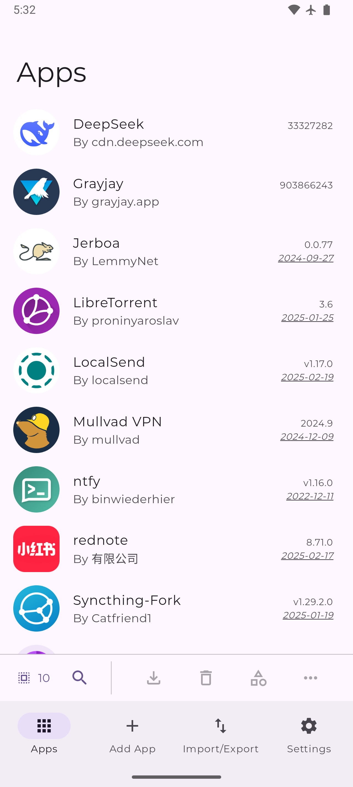

# Mobile App Analysis: Obtainium

## Design and Purpose

I selected Obtainium because it treats an Android phone more like a system the user controls than a closed appliance. Obtainium is an open-source Android utility that installs and updates applications directly from their release pages. Instead of presenting only a storefront filled with advertisements and recommendations, its main Apps screen presents a practical inventory: app icon, name, developer or source, installed version, and release date. The bottom navigation separates the workflow into Apps, Add App, Import/Export, and Settings. That format communicates the app's purpose immediately. It helps users manage software sources and updates rather than simply browse entertainment. Its broader objective is to provide a reliable management layer for Android software distributed through GitHub, GitLab, F-Droid, Codeberg, direct APK links, and other sources. As an open-source project, Obtainium is not primarily trying to sell a product. It encourages adoption and community participation by giving users an alternative to centralized app stores. I find this interesting because I am building a governance system that controls AI actions inside a repository.

## User Needs

The app addresses at least three important needs. First, it serves Android users who install open-source or specialized apps that may not appear in Google Play, which includes many people in the Android development community. A user can paste a release-page URL and continue receiving updates without repeatedly checking that website. That is the type of automation I appreciate. Second, it supports users who want more control over where an APK originates. The source is visible, and advanced filters can select the correct file when a release contains several APK variants. Third, it reduces maintenance work, which software engineers generally dislike. Obtainium compares the installed version with the latest source version, checks for updates in the background, and sends notifications. Settings can restrict checks to Wi-Fi or charging, helping users balance reliability, battery use, and network usage. Its users are likely privacy-conscious Android users, developers, testers, and open-source enthusiasts. Android's greater flexibility can appeal to these users because Apple maintains tighter control over many aspects of its devices.

## Features That Support Those Needs

The interface is built around completing a technical task with little ambiguity. The Apps list makes version status scannable, while search, sorting, and multi-select controls help manage a larger collection. Add App accepts a source URL and exposes source-specific options when automatic release detection is not enough, giving advanced users greater control. Import/Export backs up or transfers the tracked-app configuration. Background checking can use Android WorkManager for battery efficiency or an optional foreground service for devices that aggressively stop background work. When Android permits it, Obtainium can also install eligible updates in the background. Together, these features turn separate release pages into one update dashboard while leaving the user in control of each source. The interface follows the "keep it simple" design principle.

*Figure 1. Obtainium's Apps screen shows tracked sources, versions, dates, and task-based navigation.*

## Information a Developer Should Know

Before designing this app, I would research how many apps users sideload, which hosting services they trust, how comfortable they are with APK terminology, and how often they want update checks. I would need to know their Android versions, device manufacturers, battery restrictions, accessibility needs, and tolerance for installation warnings. Security research is essential because downloading directly from a source provides control but does not prove that every APK is safe. Usability tests should determine whether beginners can add an app without understanding regular expressions while advanced users can still filter release files, verify versions, and adjust background behavior. This information would help keep the default workflow easier for less-technical users without removing the controls that make Obtainium useful for advanced users.

## Sources

- https://github.com/ImranR98/Obtainium
- https://wiki.obtainium.page/app_tracking/
- https://f-droid.org/packages/dev.imranr.obtainium.fdroid/

## AI Use Acknowledgment

I used OpenAI Codex to help identify sources, revise wording, and format the picture so it fit properly with the caption. I wrote the paper, reviewed the final formatting, and verified the app's features against the official project documentation.
