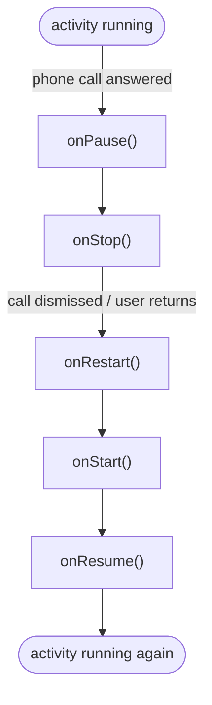
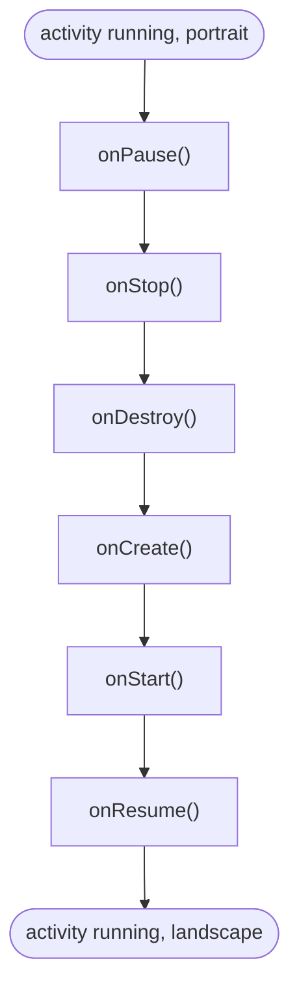

# Module 3 Notes: Android Activity Lifecycle

Study notes for *Resources: Activities and Intents*. Topic: the Activity lifecycle
as **state + lifecycle**, who owns the callbacks, and how it maps to things already
known (C memory, Rust resources, OS processes, state machines).

## Contents

1. [State and lifecycle (the core idea)](#1-state-and-lifecycle-the-core-idea)
2. [The six lifecycle callbacks](#2-the-six-lifecycle-callbacks)
3. [Who writes onCreate, onStart, etc.](#3-who-writes-oncreate-onstart-etc)
4. [Automatic vs developer-controlled](#4-automatic-vs-developer-controlled)
5. [Is it like malloc/free in C?](#5-is-it-like-mallocfree-in-c)
6. [Does importing make it happen?](#6-does-importing-make-it-happen)
7. [The lifecycle as a state machine](#7-the-lifecycle-as-a-state-machine)
8. [Flowchart (zyBooks diagram)](#8-flowchart-zybooks-diagram)
9. [Key facts from the participation activities](#9-key-facts-from-the-participation-activities)
10. [Logging lifecycle callbacks (instrumentation)](#10-logging-lifecycle-callbacks-instrumentation)
11. [@Override, method names, and super](#11-override-method-names-and-super)
12. [Manual call vs the real lifecycle transition](#12-manual-call-vs-the-real-lifecycle-transition)
13. [Configuration changes](#13-configuration-changes)
14. [How this maps to what I already know](#14-how-this-maps-to-what-i-already-know)

---

## 1. State and lifecycle (the core idea)

- **State** = what condition a component is currently in.
- **Lifecycle** = how it enters, changes, operates, and exits those states.
- Nearly every real program has both.
- Android names the UI component's lifecycle states and provides functions that run *during the transitions* between them.

## 2. The six lifecycle callbacks

| Callback | Fires when | Typical use |
|---|---|---|
| `onCreate()` | Activity is first created | Build/initialize the screen; `setContentView(...)` |
| `onStart()` | Activity becomes visible | Start work needed while visible |
| `onResume()` | Activity gains focus (foreground) | Start camera, resume playback/animations |
| `onPause()` | Activity loses focus (partly hidden) | Pause playback, stop animations |
| `onStop()` | Activity no longer visible | Unregister listeners, release heavy resources |
| `onDestroy()` | Activity instance is being destroyed | Final cleanup tied to that instance |

## 3. Who writes onCreate, onStart, etc.

- Android already defines these methods in the base `Activity` class.
- An Activity is created by **extending** that class:

```java
public class MainActivity extends AppCompatActivity {
}
```

- The framework then **calls the lifecycle methods automatically** at the right times.
- Only **override** the ones that need custom behavior:

```java
public class MainActivity extends AppCompatActivity {

    @Override
    protected void onCreate(Bundle savedInstanceState) {
        super.onCreate(savedInstanceState);
        setContentView(R.layout.activity_main);
        // Create and initialize this screen.
    }

    @Override
    protected void onStart() {
        super.onStart();
        // Start something needed while the screen is visible.
    }

    @Override
    protected void onStop() {
        // Stop something that should not run while hidden.
        super.onStop();
    }
}
```

- Do **not** call them manually in sequence:

```java
onCreate();
onStart();
onResume();   // wrong: Android invokes these for you
```

## 4. Automatic vs developer-controlled

Two sides working together.

**Android owns the machinery.** It decides when the Activity is:
- created
- made visible
- given focus
- covered by another screen
- stopped
- destroyed

**Your code reacts to the transitions.** Override the callbacks to say:
- on create: build the interface
- on resume: start the camera
- on pause: pause playback
- on stop: unregister a listener
- on destroy: release what is tied to this instance

The callbacks are **hooks provided by the framework**:

```text
Android changes the state
        v
Android invokes the callback
        v
Your override responds to the change
```

## 5. Is it like malloc/free in C?

Only partly.

- In C, memory is owned directly:

```c
char *buffer = malloc(1024);
/* use buffer */
free(buffer);
```

- `onStop()` is **not** Java's `free()`. It is an *opportunity* to stop or release resources that should not stay active in that state:

```java
@Override
protected void onStop() {
    camera.close();
    locationManager.removeUpdates(listener);
    mediaPlayer.pause();
    super.onStop();
}
```

- Java's garbage collector handles ordinary managed memory. The lifecycle callbacks deal more broadly with **behavior and resource validity**: cameras, sensors, network listeners, database observers, audio, animations, background work, UI references.
- A closer analogy than malloc/free: a framework that owns the main control flow and calls **your** functions:

```c
void screen_created(void)     { initialize_screen(); }
void screen_activated(void)   { start_camera(); }
void screen_deactivated(void) { stop_camera(); }
```

- This pattern is **inversion of control** (the framework calls you, not the reverse).

## 6. Does importing make it happen?

- No. An import only makes a class **name** available:

```java
import androidx.appcompat.app.AppCompatActivity;
```

- The part that matters is **extending** it:

```java
public class MainActivity extends AppCompatActivity
```

- By extending `AppCompatActivity`, the class *becomes* a type of Android Activity, so Android can instantiate it and call the inherited lifecycle methods.
- If `onStart()` is not overridden, the inherited implementation still runs. Override only to add custom work.

## 7. The lifecycle as a state machine

At the architectural level:

```text
Created -> Started -> Resumed -> Paused -> Stopped -> Destroyed
```

is a state machine. The general category is:

```text
current state
  + legal transitions
  + work performed on transitions
  + resources valid in each state
```

Even a small CLI program has a lifecycle:

```text
process starts
-> inputs/configuration load
-> work executes
-> results are produced
-> resources are closed
-> process exits
```

A near-stateless pure function has little internal state, but the process running it still has a runtime lifecycle.

## 8. Flowchart (zyBooks diagram)

Redraw of the course animation (frame 6). The **user returns to activity** arrow
loops `onStop()` back up to `onStart()`.


Reading the diagram:
- **Back button** calls `onPause()` then `onStop()`. On devices **before Android 12**, `onDestroy()` also runs and the activity is destroyed. Android 12+ moves the app to the background instead of destroying the activity.
- The course diagram simplifies the "user returns" path as `onStop() -> onStart()`. In the full Android lifecycle, `onRestart()` runs in between: `onStop() -> onRestart() -> onStart()`.

## 9. Key facts from the participation activities

Verified points pulled from the course questions:

- **First launch order:** `onCreate()` -> `onStart()` -> `onResume()`. All three run, then the app is visible and ready for interaction.
- **Interruption that hides the activity** (for example, answering a phone call): `onPause()` -> `onStop()`. Another activity (the phone) replaces the current one.
- **Returning after that interruption:** `onRestart()` -> `onStart()` -> `onResume()`. (The course wording only lists `onStart()` and `onResume()`; `onRestart()` runs first in the full path.)
- **Restarting a stopped-but-not-destroyed activity:** `onCreate()` is **not** called. It runs only on first launch, or when Android killed the process for memory, in which case a restart calls `onCreate()` again.
- **Back button (Android 11 and below):** calls `onDestroy()` and destroys the activity. Android 12+ does not destroy it on Back (the app is backgrounded), so it restarts faster. Home and Recents do not destroy the activity.
- **Recents button:** on newer Android it does not stop the running activity until the user actually switches to a different app. When it does stop the activity, Logcat shows `onPause` then `onStop`, in that order.
- **Reselecting a stopped activity from Recents:** logs `onStart` then `onResume` (not just `onResume`), because a stopped activity restarts through `onRestart` -> `onStart` -> `onResume`.
- **`onStop` means not visible:** if the last Logcat message is `onStop`, the activity is no longer visible.

Flowchart: phone-call interruption and return.



## 10. Logging lifecycle callbacks (instrumentation)

**Course figure (3.1.2):** an Activity that logs a message in every callback so the
developer can watch which callbacks fire and in what order. On startup, Logcat
shows `onCreate`, `onStart`, `onResume`.

```java
package com.zybooks.helloandroid;

import androidx.appcompat.app.AppCompatActivity;
import android.os.Bundle;
import android.util.Log;

public class MainActivity extends AppCompatActivity {
    private final String TAG = "Lifecycle";

    @Override
    protected void onCreate(Bundle savedInstanceState) {
        super.onCreate(savedInstanceState);
        setContentView(R.layout.activity_main);
        Log.d(TAG, "onCreate");
    }

    @Override
    protected void onStart() {
        super.onStart();
        Log.d(TAG, "onStart");
    }

    @Override
    protected void onStop() {
        super.onStop();
        Log.d(TAG, "onStop");
    }

    @Override
    protected void onDestroy() {
        super.onDestroy();
        Log.d(TAG, "onDestroy");
    }

    @Override
    protected void onPause() {
        super.onPause();
        Log.d(TAG, "onPause");
    }

    @Override
    protected void onResume() {
        super.onResume();
        Log.d(TAG, "onResume");
    }
}
```

Logcat output when the app launches:

```text
D/Lifecycle: onCreate
D/Lifecycle: onStart
D/Lifecycle: onResume
```

**How I understand it:**

- This code is **instrumentation for observation**, not lifecycle logic. The logging is added so I can *see* the order Android calls things.
- `Log.d(TAG, "onStart")` means: Android calls `onStart()` -> my override calls `super.onStart()` -> then writes a debug line to Logcat.
- `private final String TAG = "Lifecycle";` is the log **category/tag**, not the message. `Log.d(TAG, "onCreate")` prints roughly `Lifecycle: onCreate`.
- Conceptually similar to `System.out.println("onCreate")` (Java) or `print("onCreate")` (Python). The difference: `Log.d()` uses Android's logging system, and Logcat also records log level, process, thread, timestamp, and tag, and lets me filter.
- **The logging does not cause the transition.** Android causes the transition and calls the function; the log line only *proves* the callback ran.
- Not every line is logging: `super.onCreate(...)` and `setContentView(...)` do real lifecycle and UI setup. The six `Log.d(...)` lines are purely for watching the lifecycle.

## 11. @Override, method names, and super

**What `@Override` claims:** "the parent class has a method with this exact name
and signature, and I am replacing it." The compiler checks that claim.

- This does **not** compile, because `AppCompatActivity` has no method named `ANYTHINGHERE()`:

```java
@Override
protected void ANYTHINGHERE() {   // compile error: nothing to override
    super.onStart();
    Log.d(TAG, "onStart");
}
```

- Remove `@Override` and it compiles, but Android will **not** call it automatically. It runs only if I call it myself:

```java
protected void ANYTHINGHERE() {
    super.onStart();
    Log.d(TAG, "onStart");
}

public void someMethod() {
    ANYTHINGHERE();
}
```

Call chain:

```text
someMethod()
  -> ANYTHINGHERE()
    -> AppCompatActivity.onStart()   (via super.onStart())
      -> Log.d(...)
```

**Key separations:**

- The **method name** and `super.onStart()` are independent. `super.onStart()` always means "call the parent class's `onStart()`," regardless of what the enclosing method is named.
- `ANYTHINGHERE` is a **method**, not a variable.
- The only thing the name controls is **automatic dispatch**: Android invokes a method as a lifecycle callback only when its name and signature match (for example, `onStart()`). A differently named method runs the same `super.onStart()` and log line, but I have to call it myself.

Precise statement:

> Manually calling `ANYTHINGHERE()` runs the same `super.onStart()` and the same log statement. It differs only in that it is not the method Android automatically dispatches as the lifecycle callback.

## 12. Manual call vs the real lifecycle transition

The confusing question: if a custom method calls `super.onStart()`, isn't that the
same as the real `onStart()`? At the Java call level, **yes**, the same parent method
body runs. The catch: `super.onStart()` runs *one method*; it does not perform the
whole Start transition.

- `super.onStart()` = execute the parent's `onStart()` method body. That is all it does.
- The **Start transition** = the framework machinery (`performStart()` and friends) that does pre-work, calls `onStart()`, checks that `super.onStart()` was called, starts fragments, and updates the activity's real state. `onStart()` is *one step inside* that machine, not the machine.

State-machine framing: `onStart()` is the **transition handler**; Android is the
**state machine** that decides when a transition happens and calls the handler.
Running the handler by hand executes its code but does not make the machine change
state.

**Normal version (Android is the entry point):**

```java
public class MainActivity extends AppCompatActivity {
    private final String TAG = "Lifecycle";

    @Override
    protected void onStart() {      // must be named onStart, or Android cannot find it
        super.onStart();            // run the parent's onStart() body
        Log.d(TAG, "onStart");
    }
}
```

```text
Android's lifecycle machine reaches the Start step
  -> it calls MainActivity.onStart()   (it looks up that exact name)
    -> super.onStart()  runs the parent body
    -> logs "onStart"
```

**Manual version (my code is the entry point):**

```java
public class MainActivity extends AppCompatActivity {
    private final String TAG = "Lifecycle";

    @Override
    protected void onCreate(Bundle savedInstanceState) {
        super.onCreate(savedInstanceState);
        setContentView(R.layout.activity_main);
        ANYTHINGHERE();             // I call it here, myself
    }

    protected void ANYTHINGHERE() {  // any name; Android never looks for this
        super.onStart();            // runs the SAME parent onStart() body
        Log.d(TAG, "onStart");
    }
}
```

```text
Android calls onCreate()
  -> my onCreate calls ANYTHINGHERE()
    -> super.onStart()  runs the SAME parent body
    -> logs "onStart"
... later, Android still runs its real Start step and calls onStart() again
```

**The tell that proves the difference:** in the manual version the real `onStart()`
was not overridden, so when Android runs its real Start step it calls the inherited
`onStart()` anyway, and the parent body runs a second time. If the manual call had
"done the lifecycle," there would be nothing left for Android to do. There is, and
that leftover framework work is the difference.

**Bottom line:**

```text
super.onStart()   = run the parent callback body (same bell, same sound)
Start transition  = the framework deciding to start, then running that
                    callback plus its own work before and after
```

Both run the same `super.onStart()`. What differs is who calls the method, when, and
whether the activity's real state actually moved. (In practice you never hand-call
lifecycle methods; out-of-order calls can corrupt the framework's internal state.
This is only for reasoning about the difference.)

## 13. Configuration changes

**Device configuration** = a set of characteristics that describe the current state
of the device: screen orientation, screen size, language, keyboard type, and so on.
When an activity is first launched, Android uses the current configuration to load
its resources.

- An app can ship **different resources for different configurations** (for example, one layout for portrait and another for landscape).
- When a configuration characteristic changes (rotation, language, etc.), the running activity is **always destroyed and recreated** so it can reload the resources that fit the new configuration.
- This happens **even if the app has no alternate resources**. The destroy/recreate is automatic; it is not conditional on having portrait/landscape variants.
- **Changing the volume is not a configuration change**, so it does not destroy/recreate. Rotating the device and changing the language are configuration changes.

Rotation callback sequence (portrait to landscape): the old activity is torn down
and a new one is built, so all six callbacks fire.

```text
onPause() -> onStop() -> onDestroy()            (destroy the old activity)
  -> onCreate() -> onStart() -> onResume()      (recreate for the new configuration)
```



Why it matters: because the activity is destroyed and recreated on rotation, any
in-memory state that is not saved and restored is lost. This is the setup for
`onSaveInstanceState` and the `savedInstanceState` bundle seen in
`onCreate(Bundle savedInstanceState)`, which is likely the next topic.

## 14. How this maps to what I already know

- **C memory:** `malloc`/`free` is direct ownership. Lifecycle callbacks are broader (any resource), and the framework decides *when* to call them.
- **Inversion of control:** same idea as any callback-driven framework: I write the reactions, the framework drives the flow.
- **Rust resources:** different states and rules, but the same category: a value is valid in certain states and released on transitions (Rust does this with ownership and `Drop`).
- **OS processes, network connections, proof artifacts:** all analyzable as *state + legal transitions + work-on-transition + resources-valid-per-state*. Only the specific transition rules differ.
