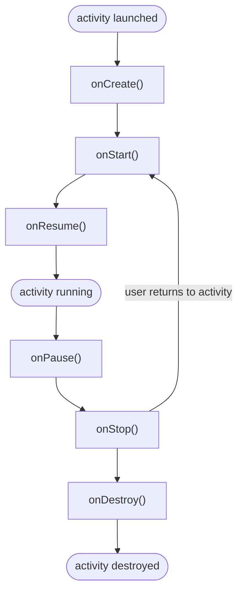

# Module 3 Notes: Android Activity Lifecycle

Study notes for *Resources: Activities and Intents*. Topic: the Activity lifecycle
as **state + lifecycle**, who owns the callbacks, and how it maps to things already
known (C memory, Rust resources, OS processes, state machines).

## Contents

1. [State and lifecycle (the core idea)](#1-state-and-lifecycle-the-core-idea)
2. [The six lifecycle callbacks](#2-the-six-lifecycle-callbacks)
3. [Who writes onCreate, onStart, etc.](#3-who-writes-oncreate-onstart-etc)
4. [Automatic vs developer-controlled](#4-automatic-vs-developer-controlled)
5. [Is it like malloc/free in C?](#5-is-it-like-mallocfree-in-c)
6. [Does importing make it happen?](#6-does-importing-make-it-happen)
7. [The lifecycle as a state machine](#7-the-lifecycle-as-a-state-machine)
8. [Flowchart (zyBooks diagram)](#8-flowchart-zybooks-diagram)
9. [How this maps to what I already know](#9-how-this-maps-to-what-i-already-know)

---

## 1. State and lifecycle (the core idea)

- **State** = what condition a component is currently in.
- **Lifecycle** = how it enters, changes, operates, and exits those states.
- Nearly every real program has both.
- Android names the UI component's lifecycle states and provides functions that run *during the transitions* between them.

## 2. The six lifecycle callbacks

| Callback | Fires when | Typical use |
|---|---|---|
| `onCreate()` | Activity is first created | Build/initialize the screen; `setContentView(...)` |
| `onStart()` | Activity becomes visible | Start work needed while visible |
| `onResume()` | Activity gains focus (foreground) | Start camera, resume playback/animations |
| `onPause()` | Activity loses focus (partly hidden) | Pause playback, stop animations |
| `onStop()` | Activity no longer visible | Unregister listeners, release heavy resources |
| `onDestroy()` | Activity instance is being destroyed | Final cleanup tied to that instance |

## 3. Who writes onCreate, onStart, etc.

- Android already defines these methods in the base `Activity` class.
- An Activity is created by **extending** that class:

```java
public class MainActivity extends AppCompatActivity {
}
```

- The framework then **calls the lifecycle methods automatically** at the right times.
- Only **override** the ones that need custom behavior:

```java
public class MainActivity extends AppCompatActivity {

    @Override
    protected void onCreate(Bundle savedInstanceState) {
        super.onCreate(savedInstanceState);
        setContentView(R.layout.activity_main);
        // Create and initialize this screen.
    }

    @Override
    protected void onStart() {
        super.onStart();
        // Start something needed while the screen is visible.
    }

    @Override
    protected void onStop() {
        // Stop something that should not run while hidden.
        super.onStop();
    }
}
```

- Do **not** call them manually in sequence:

```java
onCreate();
onStart();
onResume();   // wrong: Android invokes these for you
```

## 4. Automatic vs developer-controlled

Two sides working together.

**Android owns the machinery.** It decides when the Activity is:
- created
- made visible
- given focus
- covered by another screen
- stopped
- destroyed

**Your code reacts to the transitions.** Override the callbacks to say:
- on create: build the interface
- on resume: start the camera
- on pause: pause playback
- on stop: unregister a listener
- on destroy: release what is tied to this instance

The callbacks are **hooks provided by the framework**:

```text
Android changes the state
        v
Android invokes the callback
        v
Your override responds to the change
```

## 5. Is it like malloc/free in C?

Only partly.

- In C, memory is owned directly:

```c
char *buffer = malloc(1024);
/* use buffer */
free(buffer);
```

- `onStop()` is **not** Java's `free()`. It is an *opportunity* to stop or release resources that should not stay active in that state:

```java
@Override
protected void onStop() {
    camera.close();
    locationManager.removeUpdates(listener);
    mediaPlayer.pause();
    super.onStop();
}
```

- Java's garbage collector handles ordinary managed memory. The lifecycle callbacks deal more broadly with **behavior and resource validity**: cameras, sensors, network listeners, database observers, audio, animations, background work, UI references.
- A closer analogy than malloc/free: a framework that owns the main control flow and calls **your** functions:

```c
void screen_created(void)     { initialize_screen(); }
void screen_activated(void)   { start_camera(); }
void screen_deactivated(void) { stop_camera(); }
```

- This pattern is **inversion of control** (the framework calls you, not the reverse).

## 6. Does importing make it happen?

- No. An import only makes a class **name** available:

```java
import androidx.appcompat.app.AppCompatActivity;
```

- The part that matters is **extending** it:

```java
public class MainActivity extends AppCompatActivity
```

- By extending `AppCompatActivity`, the class *becomes* a type of Android Activity, so Android can instantiate it and call the inherited lifecycle methods.
- If `onStart()` is not overridden, the inherited implementation still runs. Override only to add custom work.

## 7. The lifecycle as a state machine

At the architectural level:

```text
Created -> Started -> Resumed -> Paused -> Stopped -> Destroyed
```

is a state machine. The general category is:

```text
current state
  + legal transitions
  + work performed on transitions
  + resources valid in each state
```

Even a small CLI program has a lifecycle:

```text
process starts
-> inputs/configuration load
-> work executes
-> results are produced
-> resources are closed
-> process exits
```

A near-stateless pure function has little internal state, but the process running it still has a runtime lifecycle.

## 8. Flowchart (zyBooks diagram)

Redraw of the course animation (frame 6). The **user returns to activity** arrow
loops `onStop()` back up to `onStart()`.



Reading the diagram:
- **Back button** calls `onPause()` then `onStop()`. On devices **before Android 12**, `onDestroy()` also runs and the activity is destroyed. Android 12+ moves the app to the background instead of destroying the activity.
- The course diagram simplifies the "user returns" path as `onStop() -> onStart()`. In the full Android lifecycle, `onRestart()` runs in between: `onStop() -> onRestart() -> onStart()`.

## 9. How this maps to what I already know

- **C memory:** `malloc`/`free` is direct ownership. Lifecycle callbacks are broader (any resource), and the framework decides *when* to call them.
- **Inversion of control:** same idea as any callback-driven framework: I write the reactions, the framework drives the flow.
- **Rust resources:** different states and rules, but the same category: a value is valid in certain states and released on transitions (Rust does this with ownership and `Drop`).
- **OS processes, network connections, proof artifacts:** all analyzable as *state + legal transitions + work-on-transition + resources-valid-per-state*. Only the specific transition rules differ.
